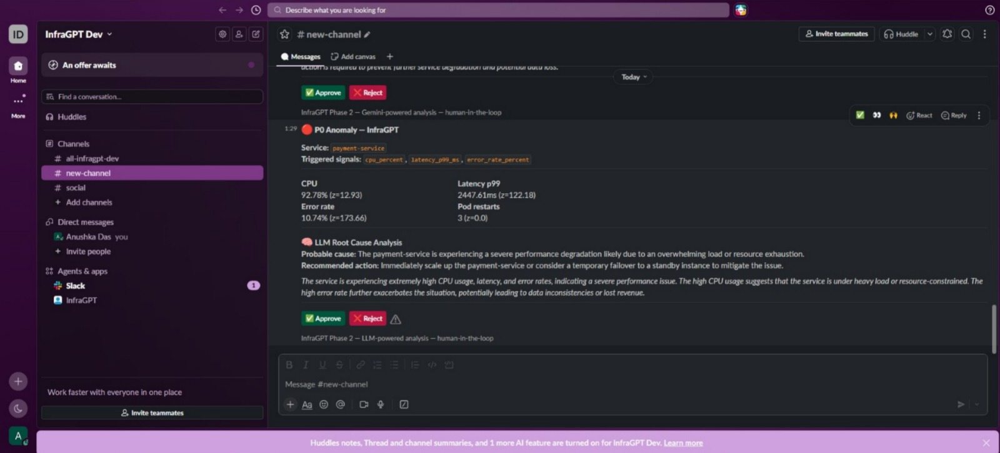
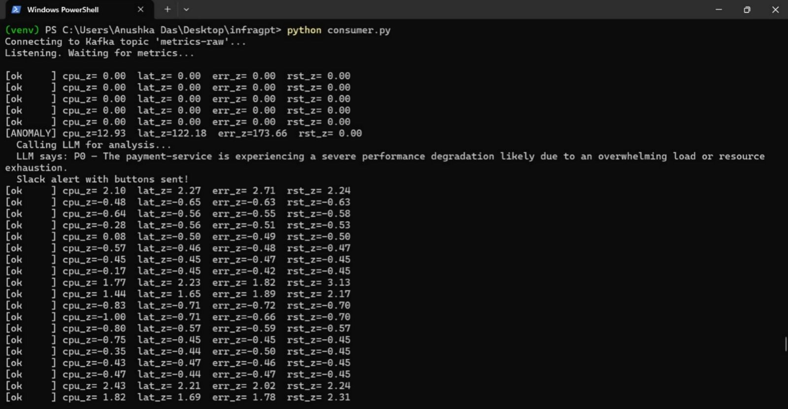

# InfraGPT — Autonomous Cloud Operations Agent

An AI agent that monitors, diagnoses, and helps self-heal cloud infrastructure in real time.
Built as a final year project demonstrating agentic AI + cloud automation + event streaming.

---

## What it does

Most monitoring tools just send alerts. InfraGPT reasons about them.

When your infrastructure behaves abnormally, InfraGPT:
1. Detects the anomaly using multi-signal statistical correlation (not just threshold breaches)
2. Calls an LLM to diagnose the root cause and recommend a fix
3. Sends a rich Slack alert with an AI-generated explanation
4. Asks for human approval before taking any action
5. Executes the remediation on approval (Phase 3: real Kubernetes)

---

## Demo

### Anomaly detected + LLM analysis + Approve/Reject buttons in Slack


### Terminal showing real-time z-score based detection


---

## Architecture
Metric Simulator → Kafka (metrics-raw topic) → Anomaly Consumer
↓
Z-score engine
(multi-signal check)
↓
LLM Agent (Groq)
(root cause analysis)
↓
Slack alert + buttons
↓
FastAPI webhook server
(receives button clicks)
↓
Remediation engine (Phase 3: K8s)
---

## Tech stack

| Layer | Technology |
|---|---|
| Event streaming | Apache Kafka (Docker) |
| Anomaly detection | Python, NumPy, z-score statistical analysis |
| LLM reasoning | Groq API (LLaMA 3.1) |
| Alert delivery | Slack Block Kit, Incoming Webhooks |
| Human-in-the-loop | Slack Interactive Buttons, FastAPI |
| Webhook server | FastAPI + uvicorn |
| Tunnel (dev) | ngrok |
| Orchestration (Phase 3) | Kubernetes via K3d |
| Backend sidecar (Phase 3) | Java Spring Boot |

---

## Why multi-signal detection matters

A naive system fires an alert when CPU > 80%.
A senior SRE ignores that — CPU spikes happen during deploys.

InfraGPT fires only when **multiple signals spike simultaneously**:
- CPU z-score > 2.5 AND
- Latency p99 z-score > 2.5 AND/OR
- Error rate z-score > 2.5

This is how real SREs think. The LLM then correlates these signals
to identify the most probable root cause — OOMKilled pod, connection
pool exhaustion, resource starvation, etc.

---

## Project structure
infragpt/
├── simulator.py        # Generates fake metrics with injected spikes
├── consumer.py         # Kafka consumer + anomaly detection engine
├── llm_agent.py        # Groq LLM integration for root cause analysis
├── webhook_server.py   # FastAPI server for Slack button callbacks
├── docker-compose.yml  # Kafka + Zookeeper local setup
├── .env                # API keys (not committed)
└── README.md
---

## How to run locally

### Prerequisites
- Python 3.11+
- Docker Desktop
- Slack workspace with InfraGPT app installed
- Groq API key (free at console.groq.com)
- ngrok (free at ngrok.com)

### Setup

```bash
# Clone the repo
git clone https://github.com/d4nushka/infragpt.git
cd infragpt

# Create virtual environment
python -m venv venv
venv\Scripts\activate  # Windows
source venv/bin/activate  # Mac/Linux

# Install dependencies
pip install kafka-python==2.0.5 requests numpy python-dotenv groq fastapi uvicorn

# Add your keys to .env
cp .env.example .env
# Fill in SLACK_WEBHOOK_URL, GROQ_API_KEY, SLACK_BOT_TOKEN, SLACK_SIGNING_SECRET
```

### Run

```bash
# Terminal 1 — start Kafka
docker compose up -d

# Terminal 2 — start webhook server
uvicorn webhook_server:app --port 8000

# Terminal 3 — start ngrok
.\ngrok.exe http 8000

# Terminal 4 — start metric simulator
python simulator.py

# Terminal 5 — start anomaly consumer
python consumer.py
```

---

## Phases

| Phase | Status | Description |
|---|---|---|
| Phase 1 | ✅ Complete | Kafka pipeline + multi-signal anomaly detection + Slack alerts |
| Phase 2 | ✅ Complete | LLM root cause analysis + human-in-the-loop Approve/Reject |
| Phase 3 | 🔨 In progress | LangGraph ReAct agent + K3d Kubernetes + auto pod restart |

---

## Key design decisions

**Why Kafka over direct function calls?**
Real infrastructure monitoring is event-driven. Kafka decouples metric
producers from consumers, allows multiple consumers, and handles backpressure.
This mirrors how production systems like Datadog and PagerDuty work internally.

**Why z-scores over fixed thresholds?**
Fixed thresholds require manual tuning per service and break during traffic
spikes. Z-scores adapt to each service's baseline automatically.

**Why human-in-the-loop?**
An LLM hallucinating in chat is funny. An LLM hallucinating while running
kubectl delete on your production cluster is not. Every remediation action
requires explicit human approval before execution.

---

## Skills demonstrated

- Event streaming architecture (Kafka, producers, consumers, topics)
- Statistical anomaly detection (z-scores, sliding windows, multi-signal correlation)
- LLM integration with structured JSON output (Groq, LLaMA 3.1)
- REST API development (FastAPI, webhook verification, Slack signature checking)
- Cloud automation concepts (SRE practices, incident response, runbooks)
- Containerisation (Docker, Docker Compose)
- Kubernetes (K3d — Phase 3)
- Java Spring Boot microservice (Phase 3)

---

## Built by

Anushka Das — CSE (Cloud Computing & Automation), Final Year
GitHub: github.com/d4nushka